# Handling user-uploaded images with ease and confidence

<div class="absolute bottom-0 left-0 w-full p-4 grid grid-cols-2 justify-items-stretch items-end gap-4">
  <div class="text-left">
    Andrey Novikov, Evil Martians<br />
    <small><a href="https://owddm.com/">Osaka Web Designers and Developers Meetup</a></small><br />
    <small><time datetime="2023-07-22">22 July 2023</time></small>
  </div>

  <div class="w-28 h-28 scaled-image justify-self-end">
    <a href="https://evilmartians.com/"></a>
  </div>
</div>

<div class="absolute top-0 left-0 w-full scaled-image h-36 p-4 text-center">
<a href="https://owddm.com/" class=""></a>
</div>


<style>
  a {
    border-bottom: none !important;
  }
</style>

---
layout: center
---

# That title is boring!

Let's change!


---
layout: cover
class: text-center
---

# imgproxy is amazing!

<div class="absolute bottom-0 left-0 w-full p-4 grid grid-cols-2 justify-items-stretch items-end gap-4">
  <div class="text-left">
    Andrey Novikov, Evil Martians<br />
    <small><a href="https://owddm.com/">Osaka Web Designers and Developers Meetup</a></small><br />
    <small><time datetime="2023-07-22">22 July 2023</time></small>
  </div>

  <div class="h-28 scaled-image justify-self-end scaled-image flex items-end gap-4">
    <a href="https://imgproxy.net/" class="">
      <LightOrDark>
        <template #dark></template>
        <template #light></template>
      </LightOrDark>
    </a>
    <a href="https://evilmartians.com/" class="">
      <LightOrDark>
        <template #dark></template>
        <template #light></template>
      </LightOrDark>
    </a>
  </div>
</div>

<div class="absolute top-0 left-0 w-full scaled-image h-36 p-4 text-center">
<a href="https://owddm.com/" class=""></a>
</div>


<style>
  a {
    border-bottom: none !important;
  }
</style>

---
layout: image-right
image: ./images/20230305_193526.jpg
class: annotated-list
---

# About me

Hi, I'm Andrey

- Back-end engineer at Evil Martians

- Writing Ruby, Go, and whatever

  Dockerfiles, Helm charts, TypeScript…

- Love open-source software

  Created and maintaining a few Ruby gems

- Living in Japan for 1 year already

- Driving a moped

  And also a bicycle to get kids to kindergarten

---


<a href="https://evilmartians.com/?utm_source=owddm&utm_medium=slides&utm_campaign=imgproxy-is-amazing">


<p class="text-2xl text-center">evilmartians.com</p>
</a>
<div class="absolute bottom-32px left-32px rotate-10 text-2xl">邪悪な火星人？</div>
<div class="absolute bottom-32px right-32px rotate-350 text-2xl">イービルマーシャンズ！</div>

---

# Martian Open Source

<div class="grid grid-cols-4 grid-rows-2 gap-4">
  <a href="https://github.com/yabeda-rb/yabeda">
    <figure>
      
      <figcaption>Yabeda: Ruby application instrumentation framework</figcaption>
    </figure>
  </a>
  <a href="https://github.com/evilmartians/lefthook">
    <figure>
      
      <figcaption>Lefthook: git hooks manager</figcaption>
    </figure>
  </a>
  <a href="https://anycable.io/">
    <figure>
      
      <figcaption>AnyCable: Polyglot replacement for ActionCable server</figcaption>
    </figure>
  </a>
  <a href="https://postcss.org/">
    <figure>
      
      <figcaption>PostCSS: A tool for transforming CSS with JavaScript</figcaption>
    </figure>
  </a>
  <a href="https://imgproxy.net/">
    <figure>
      
      
      <figcaption>Imgproxy: Fast and secure standalone server for resizing and converting remote images</figcaption>
    </figure>
  </a>
  <a href="https://logux.io/">
    <figure>
      
      
      <figcaption>Logux: Client-server communication framework based on Optimistic UI, CRDT, and log</figcaption>
    </figure>
  </a>
  <a href="https://github.com/DarthSim/overmind">
    <figure>
      
      <figcaption>Overmind: Process manager for Procfile-based applications and tmux </figcaption>
    </figure>
  </a>
  <a href="https://evilmartians.com/oss">
    <figure>
      <div class="h-40 text-2xl flex items-center justify-center">
        <qr-code-vue value="https://evilmartians.com/oss" class="scaled-image w-full h-full mx-auto p-4 dark:invert" render-as="svg" margin="1" />
      </div>
      <figcaption style="font-size: 1rem; margin-top: 0; line-height: 1.25rem;">Even more at evilmartians.com/oss</figcaption>
    </figure>
  </a>
</div>

<div v-click class="absolute bottom-32px left-32px rotate-10 text-2xl py-24 px-6 bg-rose-900/25 border border-rose-500">Today's topic</div>

<style>
  a { border-bottom: none !important; }
  figcaption {
    margin-top: 0.5rem;
    font-size: 0.6rem;
    line-height: 1rem;
    text-align: center;
  }
</style>

---

# So, you need to handle user images

 - Profile pictures
 - Product photos
 - Recipes
 - Reviews
 - Photos in feedback forms
 - …

Surprisingly often you need to do it in a web application!

---
class: annotated-list
---

# What you will do with them?

Show them in various places, of course!

 - Generate thumbnails
 
   to save bandwidth

 - Crop them
 
   to fit design

 - Add watermarks
 
   to prevent theft

 - Apply filters
 
   However, CSS can do it too

---
class: annotated-list
---

# “Classic” way

  - Upload image to the server
  
  - Store it somewhere

    Often on S3 or other cloud storage
  
  - Generate all required thumbnails

    As many as your design requires
  
  - Store them somewhere

    Again S3 or other cloud storage
  
  - Serve them to the user

    CDN will help here
  
---
transition: slide-up
---

# How “classic” way looks like

```mermaid
sequenceDiagram
    User->>Server: Uploads Image
    Server->>Storage: Stores Image
    Server->>JobQueue: Queues Job
    Server->>User: Upload successful
    User->>Server: Requests thumbnail
    Server->>Storage: Retrieves Thumbnail
    Storage-->>Server: There are no thumbnails yet
    Server->>User: “Image is processing”
    activate JobQueue
    Note over JobQueue: Job processing<br>started
    Storage-->>JobQueue: Retrieve image
    deactivate JobQueue
```



<div v-click class="absolute bottom-80px right-64px rotate-10 text-lg py-12 px-6 bg-rose-900/25 border border-rose-500 text-center">Unpredictable<br/>latency</div>

---

<div class="overflow-hidden mt--35px">
<div class="mt--75px">


</div>
</div>

---
class: annotated-list
---

# Problems of “classic” approach

 - Hard to predict latency

   These “image is processing” fallbacks are ugly

 - Hard to add new variants

   Need to reprocess all images before changing front-end

 - And hard to clean up old ones

   Space is cheap, but not free

 - Deployment gets complicated

   You need to install ImageMagick or something on all servers/containers

 - Security though

   Processing images on your servers is a security and stability risk

---
layout: cover
class: text-center
---

# Do we have to do things this way?

What if we could _just_ generate thumbnails on the fly?

---

# Meet image processing servers

They do just one thing, but do it well

There are many of them: [imaginary](https://github.com/h2non/imaginary), [thumbor](https://www.thumbor.org/), etc. And, of course, [**imgproxy**](https://imgproxy.net/)!

<Transform :scale="0.75" :origin="'top center'">


</Transform>

<!-- As you can see, application server doesn't need to serve -->

---
class: annotated-list
---

# imgproxy

 - Written in Go

   Great concurrency, low memory footprint, squeezes everything from your servers CPU

 - Uses libvips for image handling

   Along with specially crafted processing pipeline optimized for speed

 - Open source and open core

   Free to use OSS version that covers needs of 99% users, paid PRO version with more features and support for those who really need it

 - Easy to deploy

   Just spin up a Docker container ~~and forget~~ and it is ready to go.

 - Easy to use

   Just construct a URL using one of the client libraries, send it to a browser, done!

 - Secure and safe

   Uses signed URIs, handles image bombs, invalid images, and more.

---
class: annotated-list
---

# How it solves “classic” approach

 - Latency: **Dedicated service that do only images processing**

   You can scale it independently from your main application, also add CDN in front of it

 - Adding new variants: **Just construct new URL**

   Construct new URL, request it, done!

 - Cleaning up old ones: **Let CDN caches to expire**

   Do you really need to store thumbnails at all? Care only for originals.

 - Security and stability: **it is separate from your main application** 

   It handles image bombs, and other nasty stuff, but even if some malicious code will be executed, it will find itself in empty Docker container without anything in it.

<!-- Have I sold it yet? -->

---
clicks: 3
---

# What the URL!

The only thing you need to care about is constructing URLs

Given original image URL:

```
https://www.nasa.gov/sites/default/files/thumbnails/image/pia22228.jpg
```

I need to get 600×400 thumbnail for Retina displays, smart cropped, with watermark in right bottom corner.

Here is the result URL for such a thumbnail:

```txt {1-6|2|3-4|6}
https://imgproxy.evilmartians.com/
i_BtYyzw2ZsXf_qUl3nHBSu6PltlTAJYxnldtQNSh0Y/
rs:fill:300:200:1/dpr:2/g:sm/
wm:0.5:soea:0:0:0.2/wmu:aHR0cHM6Ly9pbWdwcm94eS5uZXQvd2F0ZXJtYXJrLnN2Zw/
plain/
https:%2F%2Fwww.nasa.gov%2Fsites%2Fdefault%2Ffiles%2Fthumbnails%2Fimage%2Fpia22228.jpg
```

See https://docs.imgproxy.net/generating_the_url


<Arrow v-click="1" x1="800" y1="320" x2="440" y2="360" />
<div v-click="1" class="absolute top-300px right-10px">Digital signature</div>

<Arrow v-click="2" x1="775" y1="350" x2="520" y2="380" />
<div v-click="2" class="absolute top-330px right-10px">Processing options</div>

<Arrow v-click="3" x1="785" y1="380" x2="600" y2="420" />
<div v-click="3" class="absolute top-360px right-10px">Original image URL</div>

---

## Original


---

## Resized


---
class: annotated-list
---

# Recommended setup

- Use direct-upload to cloud storage (S3, …)

  No need to pass images through your application servers at all

- Place a caching CDN in front of imgproxy

  Take repetitive load off from imgproxy, save some CO₂


<div class="p-2 text-center bg-black">
<a href="https://owddm.com/" class=""></a>
</div>

---
class: annotated-list
---

# Migration pitfalls

- Only back-end can construct URLs

  No more guessing on front-end of what variants are available

---
class: annotated-list
---

# Open source imgproxy will cover you

OSS version has everything that most web applications need…

But there are more goodies in PRO version!

 - advanced per-image settings

   Use different settings for individual images: different algorithms

 - auto-quality resizing

   Maximum per-image compression without visible quality loss

 - even smarter crop with object detection

   Detect objects using ML algorithms, use the results to crop more accurately

 - PDF support

 - SVG postprocessing

   Inject custom styles, minify 
 
 - Thumbnailing videos, animated GIFs, …

---
class: annotated-list
---

# Read more

 - [imgproxy is amazing](https://www.johnnunemaker.com/imgproxy/)

   by John Nunemaker

 - [imgproxy: Resize your images instantly and securely](https://evilmartians.com/chronicles/introducing-imgproxy)

   by Evil Martians

---

# Thank you!

<div class="grid grid-cols-[8rem_2fr_5fr] mt-12 gap-2">

<div class="justify-self-end">

</div>

<ul class="list-none">
<li><a href="https://github.com/Envek"><logos-github-icon class="dark:invert" /> @Envek</a></li>
<li><a href="https://twitter.com/Envek"><logos-twitter /> @Envek</a></li>
<li><a href="https://facebook.com/Envek"><logos-facebook /> @Envek</a></li>
<li><a href="https://t.me/envek"><logos-telegram /> @Envek</a></li>
</ul>

<div>
<qr-code url="https://github.com/Envek" caption="github.com/Envek" class="w-32 mt-2" />
</div>

<div class="justify-self-end">
<a href="https://evilmartians.com/"></a>
</div>

<div>

- <logos-github-icon class="dark:invert" /> [@evilmartians](https://github.com/evilmartians?utm_source=owddm&utm_medium=slides&utm_campaign=imgproxy-is-amazing)
- <logos-twitter /> [@evilmartians](https://twitter.com/evilmartians/?utm_source=owddm&utm_medium=slides&utm_campaign=imgproxy-is-amazing)
- <logos-linkedin-icon /> [@evil-martians](https://www.linkedin.com/company/evil-martians/?utm_source=owddm&utm_medium=slides&utm_campaign=imgproxy-is-amazing)
- <logos-instagram-icon class="dark:invert" /> [@evil.martians](https://www.instagram.com/evil.martians/?utm_source=owddm&utm_medium=slides&utm_campaign=imgproxy-is-amazing)
</div>

<div>
<qr-code url="https://evilmartians.com/" caption="evilmartians.com" class="w-32 mt-2" />
</div>

<div class="col-span-3">

Our awesome blog: [evilmartians.com/chronicles](https://evilmartians.com/chronicles/?utm_source=owddm&utm_medium=slides&utm_campaign=imgproxy-is-amazing)!

<p class="text-sm">See these slides at <a href="https://envek.github.io/owddm-imgproxy-is-amazing/">envek.github.io/owddm-imgproxy-is-amazing</a></p>

</div>
</div>

<div class="absolute top-110px right-20px">
Go get imgproxy!
<a href="https://imgproxy.net/" class="">
  <LightOrDark>
    <template #dark></template>
    <template #light></template>
  </LightOrDark>
</a>

<qr-code url="https://imgproxy.net/" caption="imgproxy.net" class="w-42 mt-2" />
</div>


<style>
  ul a { border-bottom: none !important; }
  ul { list-style-type: none !important; }
  ul li { margin-left: 0; padding-left: 0; }
</style>
