# Handling user-uploaded images with ease and confidence

<div class="absolute bottom-0 left-0 w-full p-4 grid grid-cols-2 justify-items-stretch items-end gap-4">
  <div class="text-left">
    Andrey Novikov, Evil Martians<br />
    <small><a href="https://owddm.com/">Osaka Web Designers and Developers Meetup</a></small><br />
    <small><time datetime="2023-07-22">22 July 2023</time></small>
  </div>

  <div class="w-28 h-28 scaled-image justify-self-end">
    <a href="https://evilmartians.com/"></a>
  </div>
</div>

<div class="absolute top-0 left-0 w-full scaled-image h-36 p-4 text-center">
<a href="https://owddm.com/" class=""></a>
</div>


<style>
  a {
    border-bottom: none !important;
  }
</style>

<!-- Today I would like to talk about working with user-uploaded images… or not? -->

---
layout: center
---

## That title is boring!

Let's change!

<!-- It sounds so boring, ditch it! -->

---
layout: cover
class: text-center
---

# imgproxy is amazing!

<div class="absolute bottom-0 left-0 w-full p-4 grid grid-cols-2 justify-items-stretch items-end gap-4">
  <div class="text-left">
    Andrey Novikov, Evil Martians<br />
    <small><a href="https://owddm.com/">Osaka Web Designers and Developers Meetup</a></small><br />
    <small><time datetime="2023-07-22">22 July 2023</time></small>
  </div>

  <div class="h-28 scaled-image justify-self-end scaled-image flex items-end gap-4">
    <a href="https://imgproxy.net/" class="">
      <LightOrDark>
        <template #dark></template>
        <template #light></template>
      </LightOrDark>
    </a>
    <a href="https://evilmartians.com/" class="">
      <LightOrDark>
        <template #dark></template>
        <template #light></template>
      </LightOrDark>
    </a>
  </div>
</div>

<div class="absolute top-0 left-0 w-full scaled-image h-36 p-4 text-center">
<a href="https://owddm.com/" class=""></a>
</div>


<style>
  a {
    border-bottom: none !important;
  }
</style>

<!-- I will be honest, I want to advertise one particular awesome piece of open source software called imgproxy. Because I like it so much, and, hopefully, you will like it too! Let's explore why imgproxy is amazing! -->

---
layout: image-right
image: /images/20230305_193526.jpg
class: annotated-list
---

# About me

Hi, I'm Andrey

- Back-end engineer at Evil Martians

- Writing Ruby, Go, and whatever

  SQL, Dockerfiles, TypeScript, bash…

- Love open-source software

  Created and maintaining a few Ruby gems

- Living in Japan for 1 year already

- Driving a moped

  And also a bicycle to get kids to kindergarten

<!--

And hello! This is me! My name is Andrey and exactly 1 year and 2 days ago I moved to Japan from Russia with my wife and kids. It was tough year and it has flown by so quick while I was settling down, sending kids to kidergarten and then to school, and doing my job, after all, but finally after experiencing all seasons I can say that I'm here, settled down, and I like it. Japan is astonishing country, amazing people, and great food! Just house insulation is so poor, it is my trauma from both winter and summer. Roads also too narrow sometimes.

And I'm web developer, primarily back-end one, big fan of open source and passionate about making effective and reliable software. And that's why I joined Evil Martians.

-->

---


<a href="https://evilmartians.com/?utm_source=owddm&utm_medium=slides&utm_campaign=imgproxy-is-amazing">


<p class="text-2xl text-center"><a href="https://evilmartians.com">evilmartians.com</a></p>
<p class="text-xl text-center"><a href="https://evilmartians.jp/">evilmartians.jp</a></p>
</a>
<div class="absolute bottom-32px left-32px rotate-10 text-2xl">邪悪な火星人？</div>
<div class="absolute bottom-32px right-32px rotate-350 text-2xl">イービルマーシャンズ！</div>

<!--

Evil Martians is distributed web development agency helping companies all sizes to live and prosper, we help small startups grow effectively, big enterprises to speed-up their monoliths and test hypotheses. And we focusing on developer tools, open source, and effective software development practices.

-->

---

# Martian Open Source

<div class="grid grid-cols-4 grid-rows-2 gap-4">
  <a href="https://github.com/yabeda-rb/yabeda">
    <figure>
      
      <figcaption>Yabeda: Ruby application instrumentation framework</figcaption>
    </figure>
  </a>
  <a href="https://github.com/evilmartians/lefthook">
    <figure>
      
      <figcaption>Lefthook: git hooks manager</figcaption>
    </figure>
  </a>
  <a href="https://anycable.io/">
    <figure>
      
      <figcaption>AnyCable: Polyglot replacement for ActionCable server</figcaption>
    </figure>
  </a>
  <a href="https://postcss.org/">
    <figure>
      
      <figcaption>PostCSS: A tool for transforming CSS with JavaScript</figcaption>
    </figure>
  </a>
  <a href="https://imgproxy.net/">
    <figure>
      
      
      <figcaption>Imgproxy: Fast and secure standalone server for resizing and converting remote images</figcaption>
    </figure>
  </a>
  <a href="https://logux.io/">
    <figure>
      
      
      <figcaption>Logux: Client-server communication framework based on Optimistic UI, CRDT, and log</figcaption>
    </figure>
  </a>
  <a href="https://github.com/DarthSim/overmind">
    <figure>
      
      <figcaption>Overmind: Process manager for Procfile-based applications and tmux </figcaption>
    </figure>
  </a>
  <a href="https://evilmartians.com/oss">
    <figure>
      <div class="h-40 text-2xl flex items-center justify-center">
        <qr-code-vue value="https://evilmartians.com/oss" class="scaled-image w-full h-full mx-auto p-4 dark:invert" render-as="svg" margin="1" />
      </div>
      <figcaption style="font-size: 1rem; margin-top: 0; line-height: 1.25rem;">Even more at evilmartians.com/oss</figcaption>
    </figure>
  </a>
</div>

<div v-click class="absolute bottom-32px left-32px rotate-10 text-2xl py-24 px-6 bg-rose-900/25 border border-rose-500">Today's topic</div>

<style>
  a { border-bottom: none !important; }
  figcaption {
    margin-top: 0.5rem;
    font-size: 0.6rem;
    line-height: 1rem;
    text-align: center;
  }
</style>

<!--
And for many years we created a ton of open source products, big and small, famous and not so. I even have created and am maintaining some of them.

→

But today I want to focus on one particular project, which I've been using in several projects, and is so excited about it.
-->

---

# So, you need to handle user images

<v-clicks>

 - Profile pictures
 - Product photos
 - Recipes
 - Reviews
 - Photos in feedback forms
 - …

</v-clicks>

Surprisingly often you need to do it in a web application!

<!--

It helps improve one pretty common task in web development: handling user-uploaded images. And it is so common that every web developer will face it sooner or later. And it is not only about social networks like instagram, facebook, or twitter, but also about e-commerce, blogs, and even feedback forms. Almost everywhere you need to receive photos, screenshots or drawings from your users.

-->

---
class: annotated-list
---

# What you will do with them?

Show them in various places, of course!

<v-clicks>

 - Generate thumbnails
 
   to save bandwidth

 - Crop them
 
   to fit design

 - Add watermarks
 
   to prevent theft

 - Apply filters
 
   However, CSS can do it too

</v-clicks>

<!--

And, of course, not only one need to receive images, but also then display them back in various forms back to users. And even now in year 2023 it is bad idea to let browsers download original images just to show them in some list downsized to a size of a thumb.

So one need to resize them, crop if their aspect ratio differs from desired, add watermarks, strip sensitive metadata, and maybe even apply some filters.

-->

---
class: annotated-list
---

# “Classic” way

<v-clicks>

  - Upload image to the server

    Probably among other form fields
  
  - Store it somewhere

    Often on S3 or other cloud storage
  
  - Generate all required thumbnails

    As many as your design requires
  
  - Store them somewhere

    Again S3 or other cloud storage
  
  - Serve them to the user

    CDN will help here

</v-clicks>

<!--

And there is kind of traditional way of doing it: upload image to the server, store it somewhere, generate all required thumbnails, store them somewhere, and then serve them to the user. I have implemented it once or twice long long time ago. And, believe me, it is not so easy as it sounds.

-->

---
transition: slide-up
---

# “Classic” way visualized

```mermaid
sequenceDiagram
    User->>Server: Uploads Image
    Server->>Storage: Stores Image
    Server->>JobQueue: Queues Job
    Server->>User: Upload successful
    User->>Server: Requests thumbnail
    Server->>Storage: Retrieves Thumbnail
    Storage-->>Server: There are no thumbnails yet!
    Server->>User: “Image is processing”
    activate JobQueue
    Note over JobQueue: Job<br/>started
    Storage->>JobQueue: <br/>Retrieve image
    Note over JobQueue: Generates<br>thumbnail
    deactivate JobQueue
```

<div class="mt--5px">


</div>

<div v-click class="absolute bottom-120px right-64px rotate-10 text-lg p-5 bg-rose-900/25 border border-rose-500 text-center">Unpredictable<br/>latency<br/>here</div>

<!--

Let's take a look on it from different angle, as a sequence diagram.

Usually you don't want to generate all thumbnails in sync on upload, as it takes some time, makes user to wait, and limits your application server throughput. So these resource-heavy operations are mostly moved into background jobs, but

→

It has a drawback. There is no guarantee that backround job will start processing your images immediately, and, while in local development environment it is so, on production it will probably take some unpredictable amount of time. It is latency.

But then what to do if you want to show user their precious pictures? And you probably want, but in general you can't, as there are no thumbnails yet. So you need to show some stub image saying “image is processing”. And it is not so good user experience. It sucks, to be honest.

-->


---

<div class="overflow-hidden mt--35px">
<div class="mt--67px">


</div>
</div>

<!--

Eventually, of course, image will be processed, thumbnails will be generated and stored, and become ready to be served to users, and everything will be fine.

-->

---
class: annotated-list
---

# Problems of “classic” approach

<v-clicks>

 - Hard to predict latency

   These “image is processing” fallbacks are ugly

 - Hard to add new variants

   Need to reprocess all images before changing front-end

 - And hard to clean up old ones

   Space is cheap, but not free

 - Deployment gets complicated

   You need to install ImageMagick or something on all servers/containers

 - Security also is your headache

   Processing images on your servers is a security and stability risk,
   e.g. [PNG decompression bomb](https://www.bamsoftware.com/hacks/deflate.html).

</v-clicks>

<!--
But still, this approach has plenty of limitations and drawbacks:

 - that latency about which we just talked,
 - necessity to reprocess all images when you need to add new thumbnail size **prior** to displaying (you don't know which are going to be displayed, after all) and it requires a lot of time and ultimately slows you down.
 - Cleaning up old unneeded thumbnails is also cumbersome.
 - And oh yes, you need to install imagemagick or libvips to your servers and containers, and it is not so easy as it sounds.
 - And it is also security risk, as you need to process images on your servers, so any script kid can do a Denial of Service by uploading a PNG bomb and eating all the memory on your application server.
-->

---
layout: cover
class: text-center
---

# Do we have to do things this way?

What if we could _just_ generate thumbnails on the fly?

<!--
But to be honest, even if we got used to this approach, it is not the only one. What if we could just generate thumbnails on the fly?
-->

---

# Meet image processing servers

They do just one thing, but do it well

There are many of them: [imaginary](https://github.com/h2non/imaginary), [cloudinary](https://cloudinary.com/), etc. And, of course, [**imgproxy**](https://imgproxy.net/)!

<Transform :scale="0.70" :origin="'top center'">


</Transform>

<!--
And there are such services, they are called image processing servers. There are cloud native ones, like Cloudinary, and there are self-hosted ones, like imaginary and imgproxy. And all they do is taking away burden of image processing from you and your application servers. And this is great!

As you can see from much smaller sequence diagram, application server doesn't have to even pass images through itself, all it needs to know is image URL which can be used to craft or construct URL with instructions for image processing service and it will do everything else by itself.
-->

---
clicks: 3
---

# What the URL!

The only thing you need to care about is constructing URLs

Given original image URL:

```
https://mars.nasa.gov/system/downloadable_items/40368_PIA22228.jpg
```

I need to get 300×150 thumbnail, but for Retina displays, smart cropped, and saturated, also with watermark in right bottom corner.

Here is the result URL for such a thumbnail:

```txt {1-6|2|3-4|6}
https://demo.imgproxy.net/
doqHNTjtFpozyphRzlQTHyBloSoYS13lLuMDozTnxqA/
rs:fill:300:150:1/dpr:2/g:ce/sa:1.4/
wm:0.5:soea:0:0:0.2/wmu:aHR0cHM6Ly9pbWdwcm94eS5uZXQvd2F0ZXJtYXJrLnN2Zw/
plain/
https:%2F%2Fmars.nasa.gov%2Fsystem%2Fdownloadable_items%2F40368_PIA22228.jpg
```

See https://docs.imgproxy.net/generating_the_url


<Arrow v-click="1" x1="800" y1="320" x2="440" y2="360" />
<div v-click="1" class="absolute top-300px right-10px">Digital signature</div>

<Arrow v-click="2" x1="775" y1="350" x2="520" y2="380" />
<div v-click="2" class="absolute top-330px right-10px">Processing options</div>

<Arrow v-click="3" x1="785" y1="380" x2="600" y2="420" />
<div v-click="3" class="absolute top-360px right-10px">Original image URL</div>

<!--
So yes, the central thing in this world of image processing servers is URL. You construct URL with **instructions** for image processing service and it will do everything else by itself.

In case of imgproxy URL consists of three vital parts:

 1. Digital signature, which is used to prevent unauthorized access to your imgproxy instance. So no one can generate valid URLs without knowing your secret key and use your imgproxy instance to process their images for free.

 2. Processing options, which are used to describe how to process image. In this case we want to resize it to 300×150, fill the whole area, and crop it using center of image as an anchor, then double it for Retina displays, and saturate it a bit.

 3. Original image URL, which is used to retrieve original image from storage. It can be any address in the Internet, or S3 file key or even file path local to the server imgproxy runs on.

And that's it.

-->

---

# Original image

<a href="https://mars.nasa.gov/system/downloadable_items/40368_PIA22228.jpg">

</a>

<qr-code url="https://mars.nasa.gov/system/downloadable_items/40368_PIA22228.jpg" caption="Original image: 19.9 MB" class="w-48 absolute bottom-10px right-10px" />

<!--
So we can see that original image which is quite large, and it is not so good idea to serve it to users either on mobile devicesor on desktops too, as it is too large for most cases. It doesn't even fit into slide!
-->

---

# Processed image


<qr-code url="https://demo.imgproxy.net/doqHNTjtFpozyphRzlQTHyBloSoYS13lLuMDozTnxqA/rs:fill:300:150:1/dpr:2/g:ce/sa:1.4/wm:0.5:soea:0:0:0.2/wmu:aHR0cHM6Ly9pbWdwcm94eS5uZXQvd2F0ZXJtYXJrLnN2Zw/plain/https:%2F%2Fmars.nasa.gov%2Fsystem%2Fdownloadable_items%2F40368_PIA22228.jpg" caption="Image processed with imgproxy: 32 kB" class="w-72 absolute bottom-10px right-10px" />

<!-- And here is processed image using URL from the slide before. It much smaller, saturated, and has watermark. Nice! -->

---
class: annotated-list
---

# imgproxy

<v-clicks>

 - Written in Go

   Great concurrency, low memory footprint, squeezes everything from your servers CPU

 - Uses libvips for image handling

   Along with specially crafted processing pipeline optimized for speed and concurrency

 - Open source and open core

   Free to use OSS version that covers needs of 99% users, paid PRO version with more features and support for those who really need it

 - Easy to deploy

   Just spin up a Docker container ~~and forget~~ and it is ready to go.

 - Easy to use

   Just construct a URL using one of the client libraries, send it to a browser, done!

 - Secure and safe

   Uses signed URIs, handles image bombs, invalid images, and more.

</v-clicks>

<!--

And all this is possible thanks to imgproxy, which is open source image processing server written in Go language.

Go language is well know for its performance, simplicity, and lightweight multitasking and is great choice for such networking bound servers that do a lot of input and output.

However, all heavy lifting is done by libvips, which is modern and very fast image processing library. Moreover, imgproxy uses specially crafted libvips processing pipeline optimized for speed and minimal memory footprint under heavy concurrency. imgproxy author (it is not me! I'm just happy user) consulted with libvips author to make it as optimized as possible, which makes imgproxy probably most performant image processing server out there.

It is open source, and it is open core, which means that there is free to use OSS version that covers needs of 99% users, and paid PRO version with more features and support for those who really need it. And recently imgproxy became a separate startup company with its own funding, paying customers and ambitious plans for conquering the world, so it is here to stay.

Also it is ridiculously easy to deploy, just spin up a Docker container, provide some settings as environment variables and it is ready to go.

And we already saw how easy it is to use it, just construct a URL using one of the client libraries, send it to a browser, done!

Also imgproxy is really mad about security, let's talk about it in detail.

-->

---
class: annotated-list
---

# More on security

<v-clicks>

- Signed URLs

  No one can generate URLs without knowing your secret key and use your imgproxy to process their images for free. Or DDoS and cache-poison your CDN by requesting your images with all possible sizes and options.

  Examples how to sign URL in different languages: https://github.com/imgproxy/imgproxy/tree/master/examples

- Image compression bombs

  imgproxy will check metadata and won't process images that are too large by dimensions

- Authentication

  imgproxy can check for authentication headers, and will not process images if someone try to access it bypassing CDN

- Source restrictions

  imgproxy can be instructed to allow process images only from sources that you control.

</v-clicks>

<!--

First of all it is about URL signature. Versatility of image processing servers has a downside: without any authentication malicious actor can use your instance to process their images for free, or can overwhelm it by constantly requesting all thumbnails of all possible sizes and processing options. When you sign the URL with a secret that only your application and your imgproxy instance both know prevents it altogether

Then imgproxy has defence mechanisms for nasty input images like corrupted images or compression bombs (like PNG files with a few kilobytes in size but many thousand pixels in dimensions). Imgproxy will detect such things and just refuse to process them.

Of course there are also other mechanisms like authentication headers and source restrictions, that won't allow to access imgproxy instance bypassing CDN, for example, or process images not from source you trust. But URL signature is the most important one.

-->

---
class: annotated-list
---

# How it solves “classic” approach

<v-clicks>

 - Latency: **Dedicated service that do only images processing**

   Very performant per se, and you can scale it independently from your main application, also add CDN in front of it

 - Adding new variants: **Just construct new URL**

   Construct new URL, request it, done!

 - Cleaning up old ones: **Let CDN caches to expire**

   Do you really need to store thumbnails at all? Care only for originals.

 - Security and stability: **it is separate from your main application** 

   It handles image bombs, and other nasty stuff, but even if some malicious code will be executed, it will find itself in empty Docker container without anything in it.

</v-clicks>

<!--

Okay, let's get back to “classic” approach we discussed earlier. How image processing servers in general solves its pitfalls and drawbacks?

First of all latency. As imgproxy and others are dedicated and highly performant servers to process images, you use them in sync. Craft URL, pass it to browser, then browser just makes a request and gets its thumbnail mostly instantly. For example imgproxy (thanks to libvips) is so performant, it can process dozens images per second on a basic VPS or Heroku dyno. And if it is not enough you can provision more servers behind load balancer (imgproxy scales horizontally well).

You want new thumbnail variant? Just construct new URL, request it, let CDN to cache it, done! No need to reprocess all images, no need to wait for background jobs to finish.

Removing old variants? Know what? You just don't! Let CDN caches to expire. Care only for originals.

Security is also isn't your headache anymore. Even if some malicious code will be executed, it will find itself in empty Docker container without anything to do in it.

Have I sold it to you yet?

-->

---
class: annotated-list
---

# Recommended setup

- Use direct-upload to cloud storage (S3, …)

  No need to pass images through your application servers at all

- Place a caching CDN in front of imgproxy

  Take repetitive load off from imgproxy, save some CO₂


<div class="p-2 text-center bg-black">
<a href="https://owddm.com/" class=""></a>
</div>

<!--

Let's suppose I have. There are two recommendations to run imgproxy in production.

1. Use direct-upload to cloud storage (S3, …). Probably you don't ever need to pass images through your application servers at all. Just upload them directly to cloud storage from client using S3 pre-signed URLs and pass that URL to imgproxy. It is just more performant.

2. Use CDN in production. imgproxy doesn't have any caching built in on purpose, as it is not its job. But you can place a caching CDN in front of it, like Cloudflare, and it will take repetitive load off from imgproxy.

-->

---
class: annotated-list
---

# Migration pitfalls

- Only back-end can construct signed URLs

  No more guessing on front-end of what variants are available

  But you can opt-out from signing URLs if you want


<div v-click class="mt-32 text-lg p-5 text-center">Couldn't recall any more 🌚</div>
<!--

Migration to imgproxy is pretty straightforward: you drop a ton of logic and machinery from your application and instead provide only a few settings: imgproxy or CDN URL, and secret for signing URLs and a small helper to generate and sign these URLs.

→

However, signed URLs is the only difficult place in migration. Often, applications tend to generate URLs on front-end, and it is not good idea in case of imgproxy, as it requires secret key to sign URLs. And obviously you don't want to expose secret to the front-end because it won't be secret anymore.

However, you don't have to use signed URLs, you strongly advised to do so, but if you set up other authentication mechanisms, like authentication headers or source restrictions, you can use plain URLs more or less safely.

-->

---
class: annotated-list
---

# Open source imgproxy will cover you

OSS version has everything that most web applications need…

But there are more goodies (and support) in PRO version!

<v-clicks>

 - Advanced per-image settings

   Different resizing algirithms, watermarks, compression for individual images

 - Automagic selection of image format and quality settings

   Maximum per-image compression using most modern format without visible quality loss

 - Even smarter crop with object detection

   Detect objects using ML algorithms to crop more accurately or blur them

 - SVG processing

   Inject custom styles, minify 
 
 - Videos, animated GIFs, PDFs support

   Thumbnailing videos, GIF to video conversion, getting image info

</v-clicks>

<qr-code url="https://imgproxy.net/features/" caption="imgproxy.net/features" class="w-32 absolute bottom-10px right-10px" />

<!--

And a minute of absolutely shameless advertising. As I said before imgproxy is open source and it supports everything that typical web application needs: resizing, cropping, watermarking, all common image formats, including WebP, AVIF, HEIC, including thumbnailing animated GIFs and WebP.

But there is also paid imgproxy Pro version that supports many more advanced features, like advanced per-image settings, automagic selection of quality settings and image format (it can respond with AVIF to modern browser and JPEG to older one), object detection, PDF support and more.

So if you have some special needs, you can check it out.

-->

---
class: annotated-list
---

# Read more

<v-clicks>

 - <div class="flex">
   <div class="flex-auto">

   [imgproxy is amazing](https://www.johnnunemaker.com/imgproxy/)
   
   by John Nunemaker

   heavily influenced this talk plot (and title, yes)

   </div>
   <qr-code url="https://www.johnnunemaker.com/imgproxy/" class="w-32 max-w-32 flex-1" />
   </div>

 - <div class="flex">
   <div class="flex-auto">

   [imgproxy: Resize your images instantly and securely](https://evilmartians.com/chronicles/introducing-imgproxy)
   
   by Sergey Alexandrovich (imgproxy author)

   with more details on how imgproxy works and how to use it

   </div>
   <qr-code url="https://evilmartians.com/chronicles/introducing-imgproxy" class="w-32 max-w-32 flex-1" />
   </div>

 - <div class="flex">
   <div class="flex-auto">

   [Decoding AVIF: Deep dive with cats and imgproxy](https://evilmartians.com/chronicles/decoding-avif-deep-dive-with-cats-and-imgproxy)

   by Polina Gurtovaya

   illustrated explanation of modern video and image format internals<br />and how to start using them with imgproxy!
   </div>
   <qr-code url="https://evilmartians.com/chronicles/decoding-avif-deep-dive-with-cats-and-imgproxy" class="w-32 max-w-32 flex-1" />
   </div>

</v-clicks>

<!--

And if you need more bloody details on how to do it, check these awesome blog posts.

First of all, it is blog post from John Nunemaker, one of imgproxy early adopters, it is called the same as this talk and it is not a coincidence, I pretty impressed by it. In this post John tells a story of migration of one of his projects from “classic” approach using backgorund jobs to imgproxy.

Second one is an introduction to imgproxy post from our blog, Martian chronicles, here you can know more about why and how imgproxy was created.

And the last one is about how AVIF, one of most modern image formats, is working under the hood, what is nice about it and how to start using it today with help from imgproxy

-->

---

# Thank you!

<div class="grid grid-cols-[8rem_2fr_5fr] mt-12 gap-2">

<div class="justify-self-end">

</div>

<ul class="list-none">
<li><a href="https://github.com/Envek"><logos-github-icon class="dark:invert" /> @Envek</a></li>
<li><a href="https://twitter.com/Envek"><logos-twitter /> @Envek</a></li>
<li><a href="https://facebook.com/Envek"><logos-facebook /> @Envek</a></li>
<li><a href="https://t.me/envek"><logos-telegram /> @Envek</a></li>
</ul>

<div>
<qr-code url="https://github.com/Envek" caption="github.com/Envek" class="w-32 mt-2" />
</div>

<div class="justify-self-end">
<a href="https://evilmartians.com/"></a>
</div>

<div>

- <logos-github-icon class="dark:invert" /> [@evilmartians](https://github.com/evilmartians?utm_source=owddm&utm_medium=slides&utm_campaign=imgproxy-is-amazing)
- <logos-twitter /> [@evilmartians](https://twitter.com/evilmartians/?utm_source=owddm&utm_medium=slides&utm_campaign=imgproxy-is-amazing)
- <logos-linkedin-icon /> [@evil-martians](https://www.linkedin.com/company/evil-martians/?utm_source=owddm&utm_medium=slides&utm_campaign=imgproxy-is-amazing)
- <logos-instagram-icon class="dark:invert" /> [@evil.martians](https://www.instagram.com/evil.martians/?utm_source=owddm&utm_medium=slides&utm_campaign=imgproxy-is-amazing)
</div>

<div>
<qr-code url="https://evilmartians.com/" caption="evilmartians.com" class="w-32 mt-2" />
</div>

<div class="col-span-3">

Our awesome blog: [evilmartians.com/chronicles](https://evilmartians.com/chronicles/?utm_source=owddm&utm_medium=slides&utm_campaign=imgproxy-is-amazing)!

<p class="text-sm">See these slides at <a href="https://envek.github.io/owddm-imgproxy-is-amazing/">envek.github.io/owddm-imgproxy-is-amazing</a></p>

</div>
</div>

<div class="absolute top-110px right-20px">
Go get imgproxy!
<a href="https://imgproxy.net/" class="">
  <LightOrDark>
    <template #dark></template>
    <template #light></template>
  </LightOrDark>
</a>

<qr-code url="https://imgproxy.net/" caption="imgproxy.net" class="w-42 mt-2" />
</div>


<style>
  ul a { border-bottom: none !important; }
  ul { list-style-type: none !important; }
  ul li { margin-left: 0; padding-left: 0; }
</style>

<!--

And thank you very much for listening to my maybe too much advertising talk. I hope you liked it and will try imgproxy in your projects.

Please find me in social networks and ask me anything about imgproxy or web development in general. 

Also please check our blog, Martian chronicles, we have a lot of brilliant articles there about web design, front-end and back-end development, DevOps and many more.

Thank you again. Any questions?

-->
